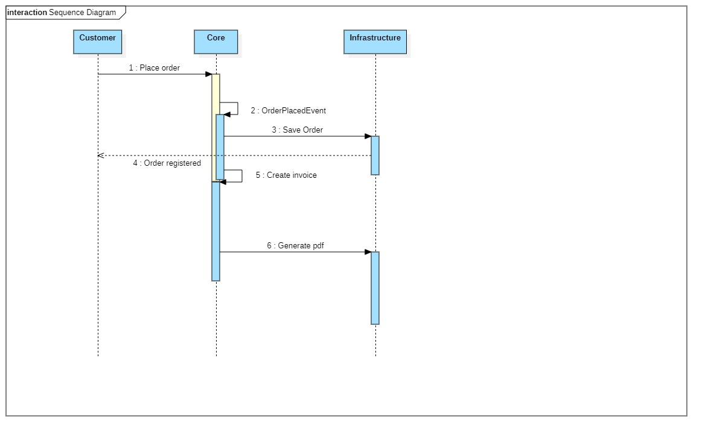

# 1 . CreateInvoiceFromOrder service:

> CreateInvoiceFromOrder service allow creating an invoice from Order when OrderWasPlaced event is raised.

# 2. InvoiceNumberGenerator service:

> This service is responsible to generate and provide a sequence number to the 
> _Invoice number_ value object.
> 
> 
> The _nextNumber_ method get invoice creation date as input parameter and generate the next number according 
> to the last invoice registered in BDD. To allow the service retrieve the last record, constructor takes 
> _Invoice repository_ as parameter.
> 
